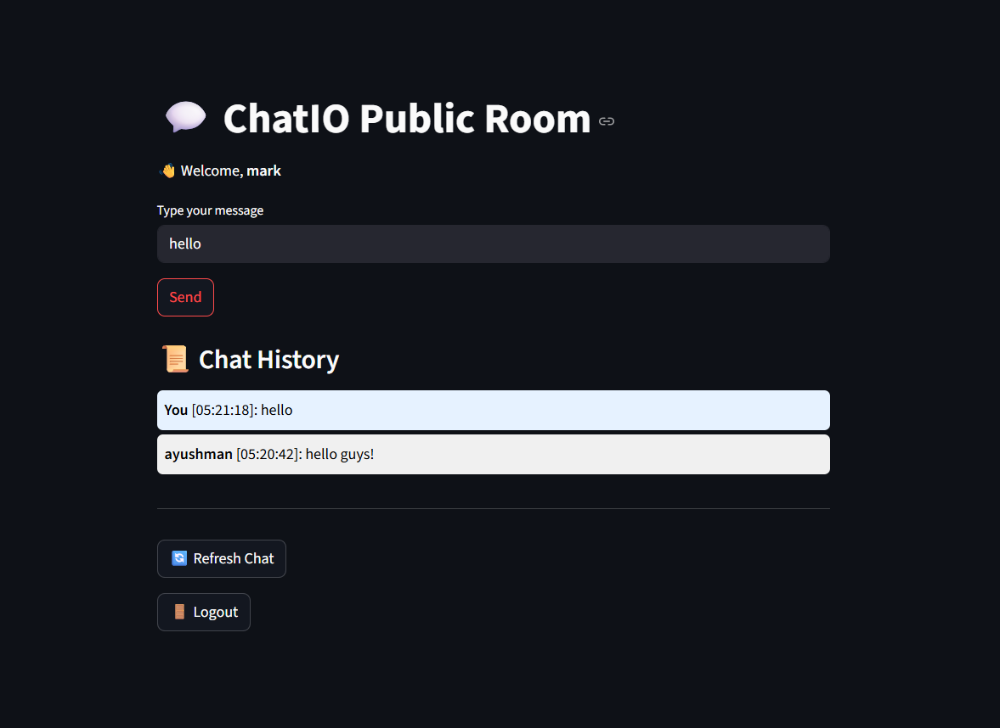

# 💬 Chatio - A Simple Streamlit Chatroom App

Chatio is a lightweight public chatroom app built with **Streamlit** that allows users to register, log in, and chat freely. Messages and user data are stored locally using JSON files, making it ideal for learning about sessions, UI state, and simple persistent storage.

---

## 🖼️ Interface

Here’s what the chatroom looks like:



---

## 🔧 Features

- ✅ User registration and login system
- 🗨️ Live chatroom for all users
- 💾 Message and user data stored in JSON files (`chat.json`, `users.json`)
- 🖤 Minimal and clean interface
- 🔒 Secure password hashing with `bcrypt`
- 💡 Safe handling of empty or missing user data

---

## 🚀 Getting Started

### 1. Clone the Repository

```bash
git clone https://github.com/ayushman-77/chatio.git
cd chatio
```

### 2. Create a Virtual Environment

```bash
python -m venv venv
# Activate the virtual environment:
# Windows:
venv\Scripts\activate
# macOS/Linux:
source venv/bin/activate
```

### 3. Install Dependencies

```bash
pip install -r requirements.txt
```

### 4. Run the App

```bash
streamlit run app.py
```

---

## 🗃️ File Structure

```
chatio/
├── app.py               # Main Streamlit app
├── chat_data.json       # Stores chat messages
├── users.json           # Stores user credentials
├── requirements.txt     # Python dependencies
└── screenshot.png       # UI preview image
```

---

## 📌 Notes

- `users.json` and `chat.json` are automatically created if they do not exist.
- If `users.json` is empty or malformed, the app still handles user registration smoothly.
